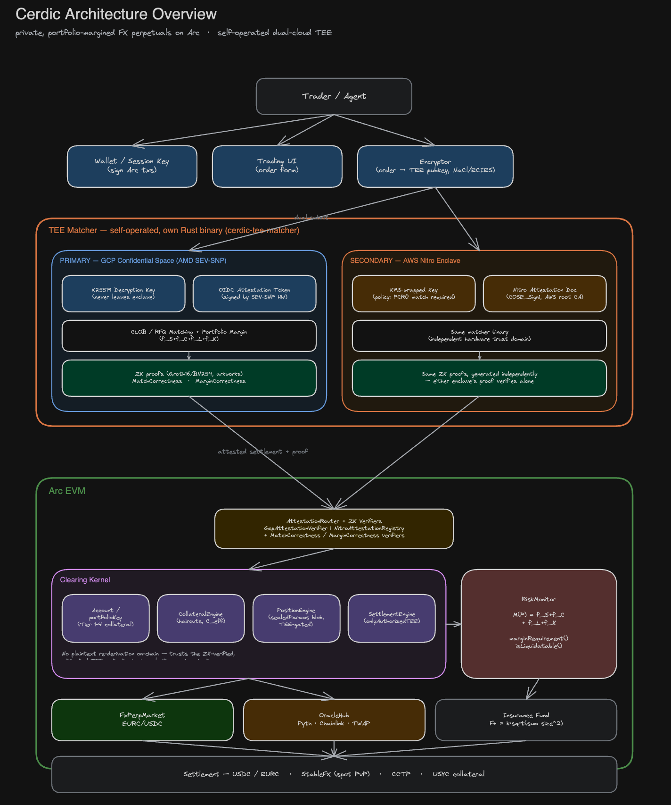

# Cerdic

Cerdic is a private, leveraged clearing layer for Arc. One collateral pool backs positions across perpetuals, FX, RWAs, and strategy vaults. Positions are margined at the portfolio level, matched inside a TEE, and earn yield the whole time.

1. **Portfolio margin.** Collateral is posted once, against the whole account, not per position. A long EURC/USDC hedge nets against a USDC-denominated perpetual instead of each requiring its own margin.
2. **Private matching.** Orders are matched inside a TEE, not a public mempool or visible order book. The chain sees a settled trade; it never sees the order that produced it.
3. **Yield-bearing collateral.** Collateral backing a position earns yield (USYC and similar instruments) instead of sitting idle.

- extensionable (hooks)

## Architecture overview



Trader/agent submits an encrypted order to a dual-cloud TEE matcher (GCP Confidential Space plus AWS Nitro Enclave, independent hardware trust domains, same matcher binary). The matcher's output passes through `AttestationRouter` and ZK verifiers on Arc EVM into the clearing kernel (accounts, collateral, positions, settlement) and risk engine, which route to markets, the oracle, and the insurance fund, settling in USDC/EURC via CCTP.

## Trade lifecycle

Every trade takes the same path, regardless of which market extension or execution mode produced the match:

```
Order submitted → Matched (TEE / CLOB) → Margin checked → Position + collateral updated
                                              │
                                           fail → back to Order submitted
```

Funding and liquidation settlement follow the same shape: an event triggers a kernel-computed balance change, applied atomically with the position update. The kernel never interprets market-specific fields (positions are opaque bytes with typed accessors); it only enforces that collateral changes are atomic with position changes.

## Portfolio margin

Margining each position independently over-collateralizes hedged accounts. A trader long 10 BTC-notional on one market and short 9.5 BTC-notional on another has 0.5 BTC of real risk but would post margin on 19.5 BTC of gross notional under isolated margin. Cerdic margins the account, not the position:

$$\mathcal{M}(\mathcal{P}) = f_S(\mathcal{P}) + f_C(\mathcal{P}) + f_L(\mathcal{P}) + f_K(\mathcal{P})$$

- $f_S$ **(scenario margin):** worst-case loss across a scenario set (parallel price shifts, funding-rate spikes, correlation breakdown).
- $f_C$ **(concentration charge):** penalizes exposure concentrated in one asset group beyond a threshold.
- $f_L$ **(liquidity charge):** larger for thinner markets, scales with position size.
- $f_K$ **(correlation adjustment):** opposite-direction correlated positions reduce margin (a genuine hedge); same-direction correlated positions increase it (concentrated risk, not diversification).

Effective collateral, summed over every posted asset:

$$\mathcal{C}_{\text{eff}} = \sum_{a} b_a \cdot (1 - h_a) \cdot p_a$$

```
Healthy --[C_eff < M]--> Warning --[C_eff < γ·M]--> Liquidation
   ^                        |
   └──────── top up / reduce ┘
```

Liquidation is tranched, not all-at-once, to avoid cascades. The insurance fund target scales with the square root of aggregate squared position size:

$$F^{*} = \kappa\sqrt{\sum_p \text{size}_p^2}$$

## Private matching

Orders are end-to-end encrypted to the TEE's public key, never touching a public mempool. Inside the enclave, the matcher decrypts, matches, checks margin, and computes settlement, then submits an attested, sealed result on-chain. The kernel trusts the attested output; it never recomputes from plaintext. It does not depend on the TEE for *correctness*, only for *confidentiality*: a compromised enclave leaks order flow, it cannot forge a settlement.

Two independent hardware trust domains run the same matcher binary: GCP Confidential Space (AMD SEV-SNP) as primary, AWS Nitro Enclaves as secondary, so no single cloud vendor's attestation chain is a single point of failure. ZK correctness proofs (`MatchCorrectness`, `MarginCorrectness`, Groth16/BN254) are generated asynchronously and verified on-chain post-settlement, threshold-gated so the common case doesn't pay proving cost up front.

## Market extensions

A market implements one interface (`IMarket`) and a handful of lifecycle callbacks; the kernel never needs to know what the market *is*. FX is the first module (EURC/USDC at launch, funding follows the interest-rate differential). Later modules, including BTC/USDC, RWA and rate markets, and strategy vaults, plug into the same interface without kernel changes.

## Papers

- [`paper/cerdic.tex`](paper/cerdic.tex): full protocol paper
- [`paper/cerdic-propdesk.tex`](paper/cerdic-propdesk.tex): prop-desk brief
- [`ARCHITECTURE.md`](ARCHITECTURE.md): implementation-level architecture and TEE deployment detail
