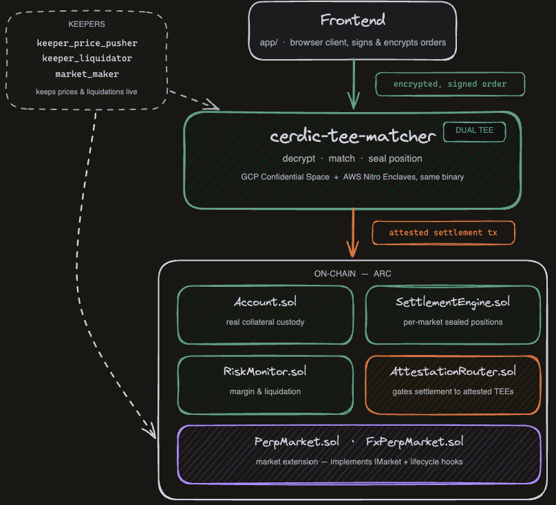

<div align="center">
  
  <h1>Cerdic</h1>
  <p>
    <b>Private, leveraged clearing for stablecoin finance on Arc.</b>
  </p>
  <p>
    <a href="https://cerdicxyz.github.io/"></a>
    <a href="https://github.com/cerdicxyz/cerdic"></a>
    <a href="https://github.com/cerdicxyz/cerdic"></a>
    
    
    
  </p>
  <p>
    <a href="https://cerdicxyz.github.io/"><b>Docs</b></a> •
    <a href="paper/cerdic.pdf"><b>Paper</b></a> •
    <a href="ARCHITECTURE.md"><b>Architecture</b></a> •
    <a href="#getting-started"><b>Getting Started</b></a>
  </p>
</div>

---

## Table of Contents

- [Meet Cerdic](#meet-cerdic)
- [Key Features](#key-features)
- [Architecture](#architecture)
- [Getting Started](#getting-started)
- [Documentation](#documentation)
- [License](#license)

---

## Meet Cerdic

Cerdic is a clearing kernel for Arc. One collateral pool backs positions across perpetuals, FX, RWAs, and strategy vaults. Positions are margined at the portfolio level, matched inside a TEE, and earn yield the whole time.

## Key Features

**Portfolio margin** Collateral is posted once, against the whole account, not per position. A long EURC/USDC hedge nets against a USDC-denominated perpetual instead of each requiring its own margin.

**Private matching** Orders are matched inside a TEE, not a public mempool or visible order book. The chain sees a settled trade; it never sees the order that produced it.

**Yield-bearing collateral** Collateral backing a position earns yield (USYC and similar instruments) instead of sitting idle.

**Market extensions** A market implements one interface (`IMarket`) and a handful of lifecycle callbacks; the kernel never needs to know what the market _is_. FX is the first module.

## Architecture

<p align="center">
  
</p>

**Matching kernel** ([`crates/cerdic-tee-matcher`](crates/cerdic-tee-matcher)) — one Rust binary that decrypts signed orders, matches them against an in-memory book, and seals the resulting position (side, size, leverage never touch plaintext on-chain). Designed to run identically inside GCP Confidential Space and AWS Nitro Enclaves, so no single cloud vendor's attestation chain is a single point of trust.

**Settlement layer** ([`packages/contracts`](packages/contracts)) — `Account.sol` is the one place real collateral custody lives (plain ERC20 deposit/withdraw); `SettlementEngine.sol` is deployed once per market and tracks each sealed position's collateral bound, gated to attested TEE callers via `AttestationRouter.sol`; `RiskMonitor.sol` enforces margin on withdrawal and liquidation. Trading itself is pure accounting inside `SettlementEngine`, reconciled against real custody in `Account.sol` — no on-chain gas cost per fill.

**Keepers** ([`crates/cerdic-tee-matcher/src/bin`](crates/cerdic-tee-matcher/src/bin)) — independent processes that keep the system live: `keeper_price_pusher` pushes real Pyth prices on-chain (funding checkpoints revert without it), `keeper_liquidator` watches public sealed-position events and liquidates underwater portfolios, `market_maker` provides resting liquidity.

**Frontend** ([`app/`](app)) — a browser client that signs and encrypts orders client-side before they ever reach the matcher.

Full depth (privacy model, correctness proofs, market lifecycle) is in the [docs](https://cerdicxyz.github.io/guide/architecture).

## Getting Started

```bash
git clone https://github.com/cerdicxyz/cerdic
cd cerdic
```

The monorepo contains contracts, a Rust matching engine, a TEE prototype, and a frontend. See [`docs/`](docs/) for detailed setup.

## Documentation

- [cerdicxyz.github.io](https://cerdicxyz.github.io/) — public docs: concepts, trading, API/contract reference.
- [`ARCHITECTURE.md`](ARCHITECTURE.md) — the full internal architecture writeup.
- [`docs/`](docs/) — deployment runbooks, keeper setup, and other operational notes.

## License

[MIT](LICENSE)
