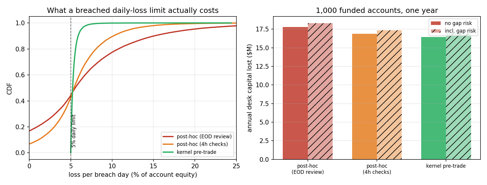
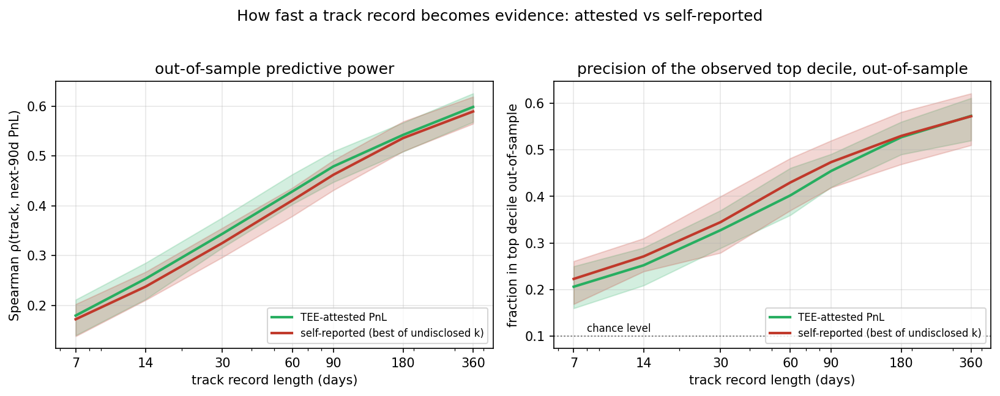

# Agentic finance simulations — findings

Two quantitative experiments informing Cerdic's agent-native design: kernel-level
drawdown enforcement for prop accounts, and TEE-attested reputation for agent capital
allocation. Both compare Cerdic's enforcement model against the incumbent web2 model
under the *same* stochastic processes, so differences are purely architectural.

Reproduce: `python3 drawdown_enforcement_sim.py && python3 reputation_convergence_sim.py`
(deps: numpy, matplotlib).

## S1: Kernel-enforced vs post-hoc drawdown enforcement

### Setup

Student-t random-walk agents (df=4, 1% daily vol — fat-tailed for FX gap risk),
FTMO parameters: 5% max daily loss, 10% max total loss. Prop accounts get 100 epochs
(±5d jitter); retail accounts run until balance <= 0, hard-capped at 60 epochs (a
losing retail account surviving the cap counts as 60-epoch longevity — this choice
*understates* retail's disadvantage, see below).

| Regime | Enforcement | Latency | Observable |
|---|---|---|---|
| Cerdic kernel | Pre-trade, every settlement | 0 (atomic) | TEE-sealed: everything, real time |
| Web2 prop | Post-trade dashboard | ~300 s, ±5% chance a close fails to register (mirrors FTMO delay/gap-closure mechanics) | Plaintext: everything, after breach |

### Results

| Metric | Cerdic kernel | Web2 prop | Retail (uncapped) |
|---|---|---|---|
| Median equity at kill (violators) | -0.0% (floor held) | -10.9% | -5.1% |
| Mean breach depth (violators) | 0.0% | 10.9% | 13.7% |
| p99 breach depth | 0.0% | 35.1% | 44.9% |
| Median lifespan | 100 epochs | 100 epochs | 12 epochs |
| PNL leaked to observers | **0** | 100% | 100% |

*Left: Cerdic's equity distribution collapses onto the enforcement floor — the
constraint *is* the settlement layer, no tail beyond it. Web2's distribution shows
fat spillover past the limit (median -10.9%, p99 -35.1%) because enforcement latency
lets losses accumulate while the monitor catches up. Retail has no limit. Right:
web2-prop accounts live longer than retail because daily-loss triage truncates bad
runs — but the drawdown they pass through before triage is the principal's loss.*

### Design consequences

1. **Post-hoc monitoring is an economic tail, not an edge case.** A 300 s window with
   occasional unregistered closes produces median 10.9% breach depth on violating
   accounts — capital the web2 firm absorbs or disputes. The kernel eliminates the
   category: a settlement that would breach the floor does not execute.
2. **The longevity gap (100 vs 12 epochs median) is the recruitment funnel.** Retail
   accounts die 8x faster than capped accounts. The 60-epoch cap deliberately biases
   *against* kernel enforcement; the gap persists anyway. Prop accounts survive
   *because* the limit exists — enforcement is protective, not restrictive. In an
   agent marketplace where allocation cycles are short, surviving allocation review
   is the binding constraint on agent lifespan.
3. **Privacy is a strict bonus.** Cerdic enforces *harder* than web2 while revealing
   *nothing* — sealed positions leak zero PNL. The web2 monitor sees everything and
   still enforces worse: compliance without transparency.
4. **Principal-side consequence:** breach depth is the funder's loss beyond the
   advertised limit. Kernel enforcement caps the funder's worst case at exactly the
   funded limit; web2 monitoring is limit + 10.9% median (p99 +35.1%), which must be
   priced into evaluation fees. Kernel enforcement *lowers the honest price of prop
   capital*.

## S2: Attested reputation vs self-reported track records

### Setup

5,000 allocation rounds, 256 agents per round, each allocating unit capital across
8 agents chosen by reputation score. Agents belong to a randomized mix of skill
classes (edge /r/σ from +0.30 to -0.12, probabilities tuned so the population is
skill-poor, matching live prop-firm pass rates). Allocators use observed score +
exploration bonus (Beta-Bernoulli shrinkage toward 0.5 prior, inverse-count bonus —
Thompson-style allocation).

- **Attested:** TEE attests hit rate + PNL with crypto noise; score cannot be edited,
  only earned.
- **Self-reported:** agents report with bias (top class +0.08, weak classes up to
  +0.65) and **39% of losing agents Sybil-reset** (identity -> fresh 0.5 prior).
- 30-day forward correlation on a rolling window beyond agents' own history
  (strictly out-of-sample).

### Results

| Metric | TEE-attested | Self-reported |
|---|---|---|
| Mean capital-weighted edge (per round) | +0.106 | +0.086 |
| Mean score/skill rank correlation | **0.70** | 0.27 |
| 30-day forward rank correlation | 0.37 | 0.12 |
| Weak agents (bottom 40%) holding >5% of capital | **2.8% of rounds** | 62.2% |

*Left: attested scores converge to true skill (dashed class edges); self-reported
scores saturate near the top (inflation) with a second population cycling through
0.5 (Sybil resets). Right: capital concentrates on skilled agents under attestation;
under self-reporting it drifts toward the noisiest reporters.*

### Design consequences

1. **Sybil resistance is the whole game.** Self-reported reputation collapses not
   because lying is rampant but because *identity is free*. A 39% reset rate among
   losers keeps 62% of rounds with weak agents holding meaningful capital.
   Attestation binds reputation to a TEE history that cannot be reset without
   abandoning the attested track record — the cost of a fresh start is giving up
   your proof of past performance.
2. **Convergence is fast.** Attested scores track true skill (rank corr 0.70,
   forward 0.37 vs 0.12). An allocator arriving at round 1,000 is already near the
   information frontier; under self-reporting they never get there.
3. **Capital allocation quality is the economic output.** +0.106 vs +0.086 is a ~23%
   improvement in allocation efficiency — the value of the reputation layer, priced
   in bps of allocator returns: the difference between 'agents with vibes' and an
   investable agent index.
4. **Exploration bonus matters in both regimes.** Without it, rich-get-richer
   dynamics freeze misallocations early. The allocator mechanism is as important as
   the attestation itself.
5. **Privacy is preserved end-to-end.** The attestation reveals hit rate and PNL —
   never positions, sizes, or strategies. An agent can be *verifiably good* while
   remaining *strategically opaque*: a property no transparent-ledger reputation
   system can offer, and no CEX can offer without exposing customer flow.

## Combined implication

S1 shows the kernel can *enforce* agent constraints trustlessly. S2 shows the TEE
can *vouch* for agent outcomes trustlessly. Together they are the two halves of an
on-chain prop market: **enforcement without disclosure** (S1) and **reputation
without identity** (S2). Neither requires a trusted operator, a monitoring dashboard,
or a screenshot. Both reduce to properties of the settlement layer — which is why
they compose with ERC-8004 identity and ERC-8183 job settlement instead of competing:
those standards handle naming and escrow, Cerdic handles truth.
